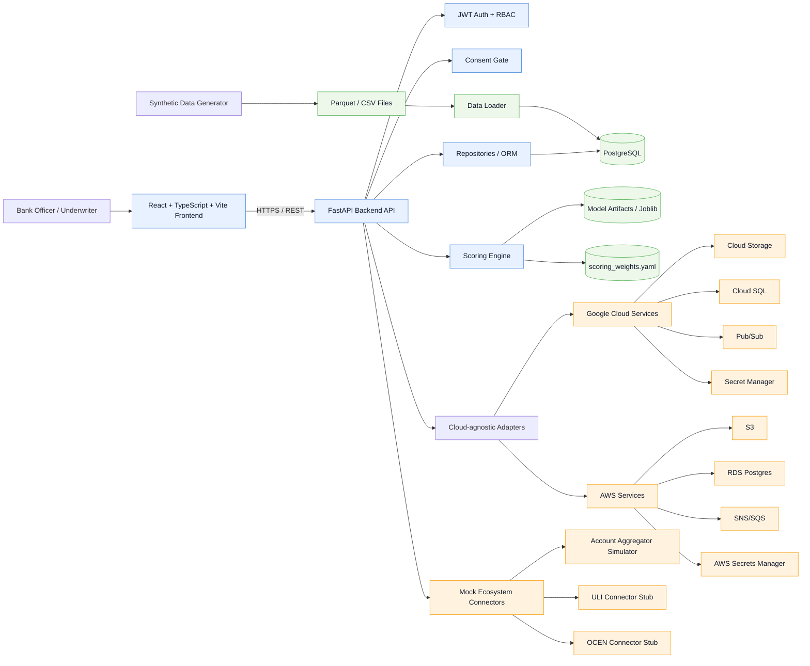

# Architecture Diagram

## Notes
- The frontend is decoupled from the backend and talks only through the documented REST API.
- The backend uses adapter interfaces so the app can run on GCP or AWS with minimal change.
- Synthetic data flows from the generator into PostgreSQL for local demo and testing.
